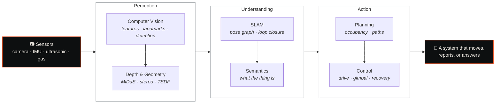

---

### Currently

Researcher at the **Woosong University AI Lab** — working on **pose estimation and computer vision**, alongside autonomous robotic platforms and model training. Co-authoring papers with faculty for IEEE submission.

Holding a 100% merit scholarship and full GPA across four consecutive semesters, and serving as a Global Peer Leader.

---

### Selected work

| Project | What it does | Stack |
| :--- | :--- | :--- |
| **[AETHER-SLAM](https://github.com/sahaj2310-tech/AETHER-SLAM)** | Live dense 3D room scanning from a single webcam — monocular visual SLAM, neural depth, TSDF fusion, streamed to a browser. No LiDAR. | Python · PyTorch · Open3D · MiDaS · CUDA |
| **[TerraVanguard](https://github.com/sahaj2310-tech/TerraVanguard)** | Autonomous terrain rover: differential drive, triple-ultrasonic avoidance, gyro-stabilised camera gimbal, live MJPEG — all on one MCU. | ESP32-S3 · C++ · MPU9250 |
| **[WatchCore RTOS](https://github.com/sahaj2310-tech/WatchCore-RT-OS)** | Fault-tolerant FreeRTOS supervisor for a simulated 4-spacecraft constellation, with anomaly detection and autonomous recovery. | FreeRTOS · C · TypeScript · SQLite |
| **[AeroSense](https://github.com/sahaj2310-tech/AeroSense)** | Real-time air quality monitoring and forecasting — 13 sensing channels, XGBoost classification plus LSTM forecasting. | ESP32 · Python · XGBoost · TensorFlow |
| **[UniMate](https://github.com/sahaj2310-tech/UniMate)** | University assistant that refuses to guess: source-grounded RAG with citations, 14 languages, injection guards. | FastAPI · pgvector · Ollama · React |
| **[Voice AI Assistant](https://github.com/sahaj2310-tech/Voice-AI-Assistant)** | Self-hosted Korean voice front desk — Whisper STT, local LLM over RAG, edge-tts, Twilio phone integration. | Whisper · Ollama · FastAPI · Twilio |
| **[Glassly](https://github.com/sahaj2310-tech/Glassly-AI)** | On-device AI skin analysis. Real-time facial landmarking, nothing leaves the phone. → [www.glasslyai.com](https://www.glasslyai.com/) | MediaPipe · TensorFlow.js · Capacitor |
| **[ClarityDeck](https://github.com/sahaj2310-tech/claritydeck)** | Turns messy input into a structured, shareable card using a local LLM. No cloud, no rate limits. | Next.js · FastAPI · Ollama |

Also building an **AI-based reconnaissance rover** — stereo VSLAM and custom YOLO detection on a Raspberry Pi 5 with an AI accelerator. Field hardware, no public repo.

---

### How the work fits together

Everything below runs the same loop: raw sensor data in, a usable understanding of the world out, then something acts on it.

AETHER-SLAM is the whole loop in one system. TerraVanguard and the recon rover are the loop on hardware that has to survive contact with the ground. WatchCore is the loop when failure is the interesting case.

---

### By the numbers

| | |
| :-- | :-- |
| **9** | shipped projects, from monocular SLAM to a self-hosted voice agent |
| **1** | peer-reviewed paper, first author, in *Sensors* (MDPI) |
| **10** | verified credentials — Microsoft, AWS, PAMS, Korea University |
| **4** | consecutive semesters at full GPA, on a 100% merit scholarship |
| **3** | languages: English and Hindi fluent, Korean to Level 3 |

---

<b>What I am reaching for next</b>

 

- **Pose estimation that survives the real world** — occlusion, motion blur, and the moments a tracker normally gives up.
- **Perception that runs where the sensors are.** Cloud inference is a latency budget nobody actually has on a moving robot.
- **Systems that admit uncertainty.** UniMate refuses to answer when its sources do not cover the question; I want that instinct everywhere.
- **More papers.** Further work with faculty is in preparation for IEEE venues.

<b>Hardware I have actually put in the field</b>

 

| Platform | Compute | Sensing |
| :--- | :--- | :--- |
| Recon Rover | Raspberry Pi 5 (16 GB) + AI HAT accelerator | ORB stereo camera |
| TerraVanguard | ESP32-S3 | MPU9250 IMU · 3× HC-SR04 · DHT11 · camera |
| AeroSense | ESP32 | MQ-135 · DHT22 · PM sensing, 13 channels |

---

### Published

> **Sinha, S.**, Lee, S., & Singh, S. (2026). *Survey on Reconnaissance Autonomous Robotic Systems for Disaster Management.* **Sensors** (MDPI), 26(5), 1659.
>
>  

Further papers in preparation with faculty, for IEEE journals and other venues.

---

### Stack

<b>Languages</b>

 

<b>Perception &amp; learning</b>

 

<b>Embedded &amp; systems</b>

 

<b>Interfaces &amp; services</b>

 

---

### Certified

`DP-900` Azure Data Fundamentals · `AI-900` Azure AI Fundamentals · `CLF-C02` AWS Cloud Practitioner · Korean Language Level 3, Korea University

---

### Pinned work

  

### Contribution graph, eaten

<picture>
  <source media="(prefers-color-scheme: dark)" srcset="https://raw.githubusercontent.com/sahaj2310-tech/sahaj2310-tech/output/github-snake-dark.svg" />
  <source media="(prefers-color-scheme: light)" srcset="https://raw.githubusercontent.com/sahaj2310-tech/sahaj2310-tech/output/github-snake.svg" />
  
</picture>

 

 

 

---

**[sahaj-sinha.netlify.app](https://sahaj-sinha.netlify.app)** · Daejeon, South Korea

